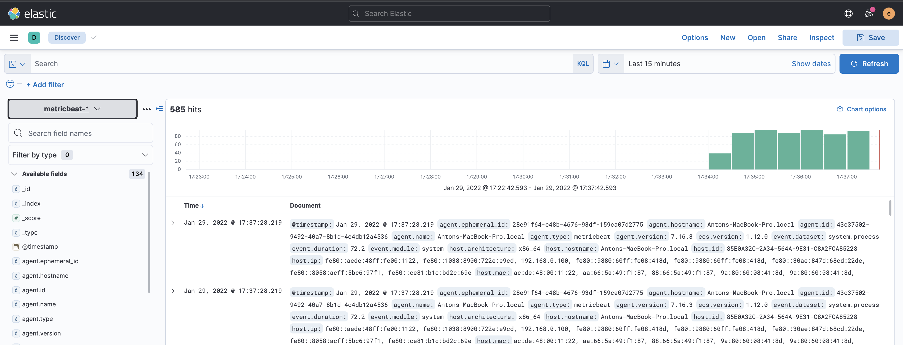

# ELK

This code was downloaded from https://github.com/deviantony/docker-elk
And as basic was used this post: https://logz.io/blog/elk-stack-on-docker/

But with some changes. You can use metricbeat.yml to configure metricbeat.
Additional tutorial: [Metricbeat quick start](https://www.elastic.co/guide/en/beats/metricbeat/7.16/metricbeat-installation-configuration.html#other-installation-options)

Screenshot:
